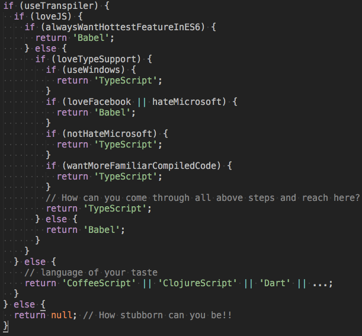

# JavaScript Flavors

1. [ES6](http://es6-features.org/) :fire:
2. [TypeScript](http://www.typescriptlang.org/) :fire:
3. [Flow](https://flow.org/)
4. [Reason](https://reasonml.github.io/) :fire:
5. [Elm](http://elm-lang.org/)
6. [ClojureScript](https://clojurescript.org/)

